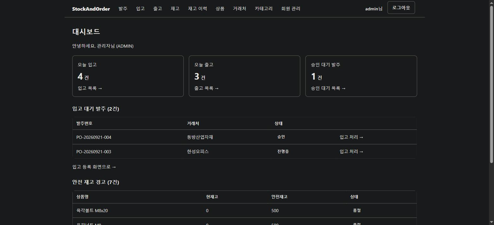
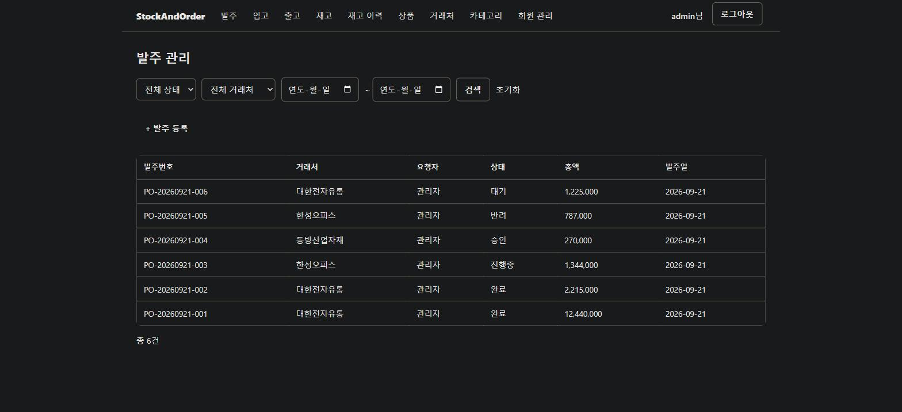
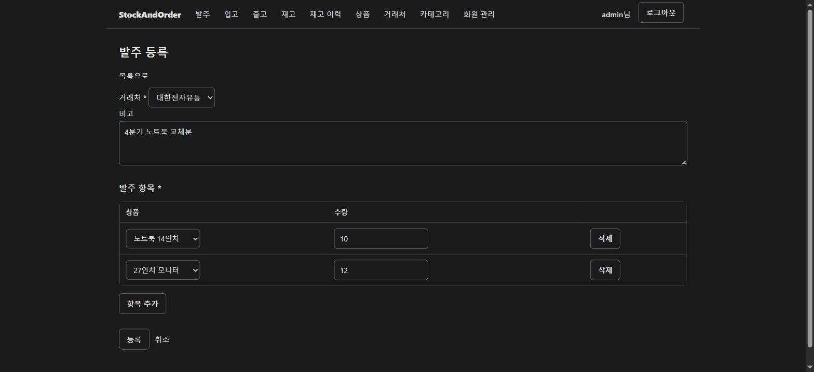
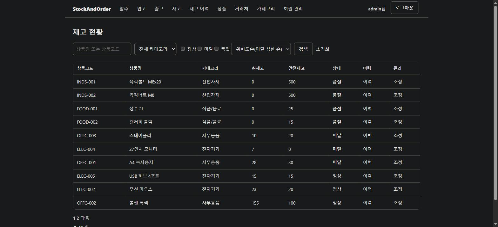
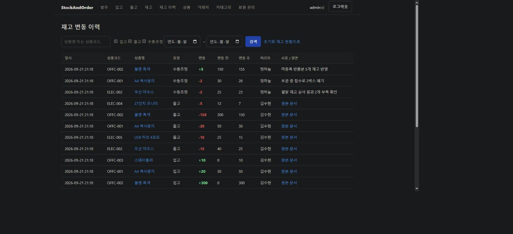
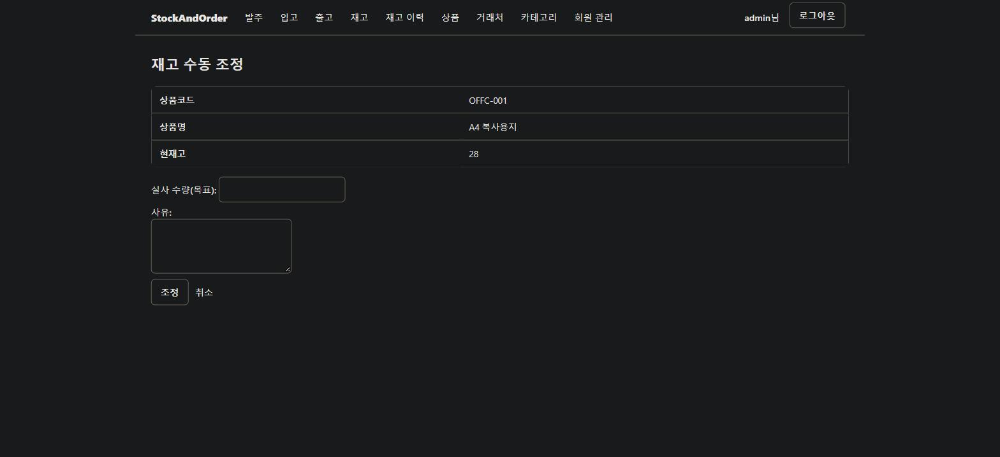
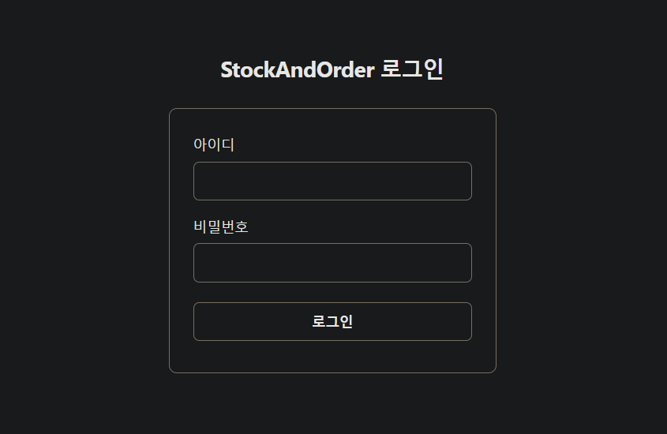
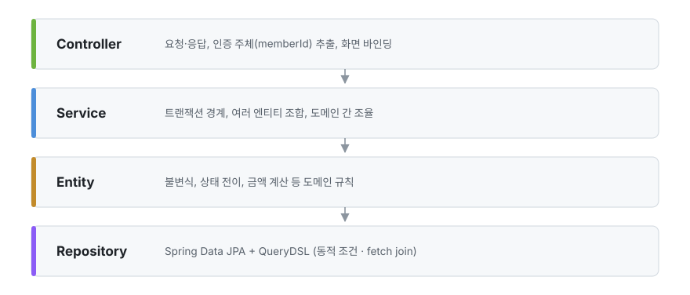
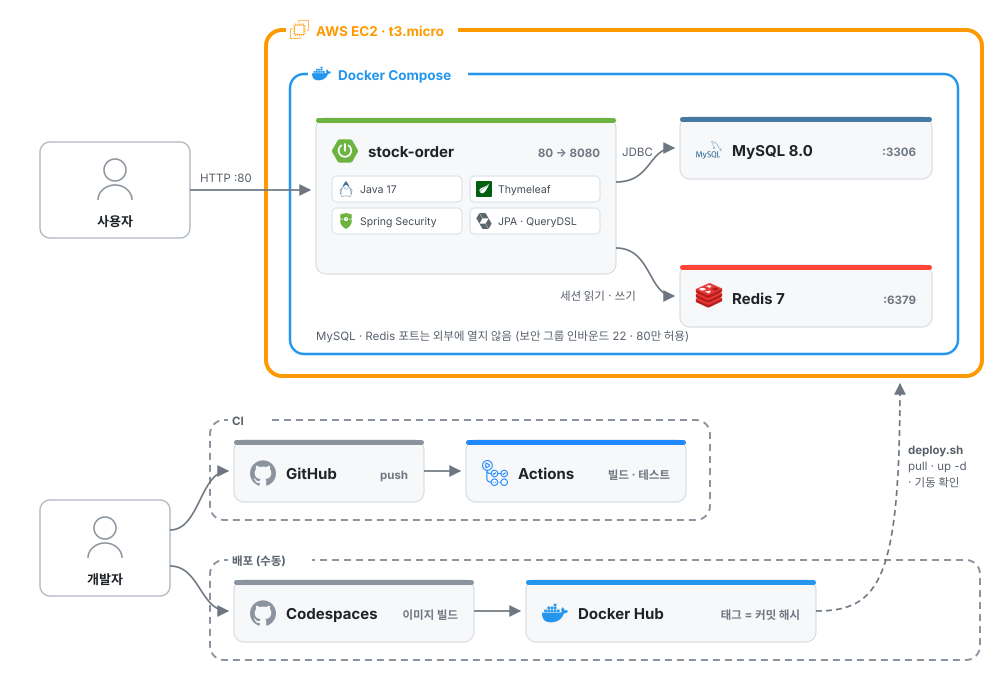
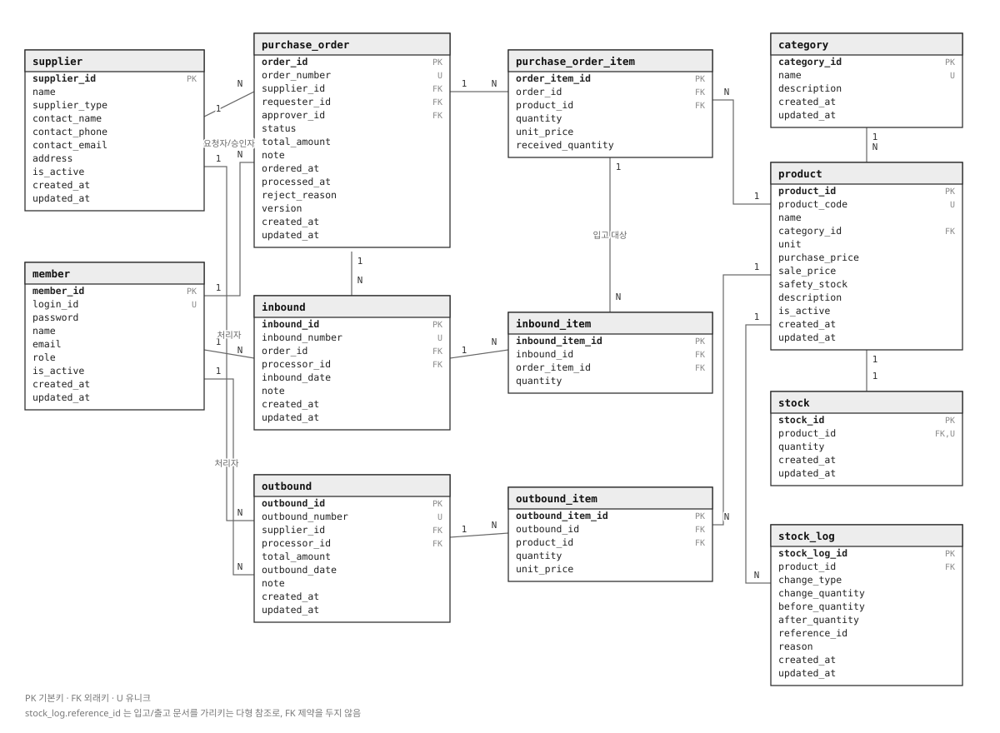

# StockAndOrder

유통사의 발주 → 입고 → 출고 → 재고를 하나의 흐름으로 관리하는 사내 재고·주문 관리 시스템입니다.

[](https://github.com/SeonHoKim7/stock-order/actions/workflows/ci.yml)


**배포 링크(AWS EC2)** http://52.79.187.44

테스트 계정은 다음과 같습니다.

| 아이디 | 비밀번호 | 권한 |
|---|---|---|
| `testadmin` | `testadmin1` | ADMIN (공용 데모 계정) |

- 최근 3주간의 발주·입고·출고·재고 조정 샘플 데이터가 들어 있습니다.
- 여러 사람이 함께 쓰는 계정이라 비밀번호 변경, 본인 계정의 비활성화·역할 변경, 초기 관리자 계정의 비활성화·역할 변경은 막아 두었습니다.
- 다른 방문자가 데이터를 바꿔 두었을 수 있습니다.

---

## 목차

- [개요](#개요)
- [기술 스택](#기술-스택)
- [기술적 의사결정과 문제 해결](#기술적-의사결정과-문제-해결)
- [주요 기능](#주요-기능)
- [아키텍처](#아키텍처)
- [DB 설계](#db-설계)
- [주요 엔드포인트](#주요-엔드포인트)
- [프로젝트 구조](#프로젝트-구조)
- [테스트](#테스트)

---

## 개요

수기 장부로 재고를 관리하는 소규모 사업장들을 대상으로 했습니다.

해당 사업장들은 발주서와 실제 입고 수량이 어긋나거나 출고 후 재고 수치가 맞지 않는 문제가 반복적으로 발생한다고 가정했습니다.

따라서 이 프로젝트는 발주·입고·출고·재고 네 단계를 한 흐름 안에서 연결하고, 재고 수치가 언제나 변동 이력으로 설명 가능한 상태를 유지하는 것을 목표로 진행했습니다.

```
발주 요청(STAFF)  →  승인/반려(MANAGER)  →  입고 처리  →  재고 증가
                                                            ↕  재고 수동 조정
                                           출고 처리  →  재고 감소
```

다수의 기능을 나열하는 방향보다는 재고 정합성과 동시성에 집중하여 깊게 다루는 방향으로 설계했습니다.

| 항목 | 내용                                     |
|---|----------------------------------------|
| 개발 기간 | 2026.03 ~ 2026.09                      |
| 인원 | 1인 (개인 프로젝트)                           |
| 담당 범위 | 요구사항 정의, DB 설계, 백엔드 전 영역, 화면, 배포 환경 구성 |

---

## 기술 스택

| 구분 | 기술 |
|---|---|
| Language | Java 17 |
| Framework | Spring Boot 3.5.11, Spring MVC |
| 인증/인가 | Spring Security (세션 기반), Spring Session Data Redis |
| 데이터 | Spring Data JPA (Hibernate), QueryDSL 5.1.0 |
| DB | MySQL 8.0 / H2 (테스트) |
| View | Thymeleaf, thymeleaf-extras-springsecurity6 |
| 빌드 | Gradle |
| 테스트 | JUnit 5, Mockito |
| 인프라 | AWS EC2, Docker, Docker Compose, Docker Hub, GitHub Actions (CI), GitHub Codespaces |

QueryDSL - 발주와 재고 목록의 검색 조건은 사용자가 골라서 넣는 구조기 때문에 조건 조합마다 조회 메서드를
새로 만들어주거나, JPQL 문자열에 if로 붙여야 했습니다. 그런데 문자열의 경우 오타가 나도 실행할 때까지 모를
수 있으므로 컴파일 단계에서 잡기 위해 QueryDSL을 통한 동적 쿼리를 작성했습니다.

세션 기반 인증 - 사내 시스템인만큼 관리자가 계정을 끊으면 즉시 로그아웃 시킬 수 있어야 했습니다.
JWT의 경우 클라이언트가 토큰을 들고 있고, 유효 기간이 만료될 때까지 무효화 시키기 어렵기 때문에 세션 기반 인증
방식을 택했습니다. 또한 이 프로젝트는 서버를 여러 대로 확장할 일이 없다고 가정했고 따라서 확장 이점이 없다고
판단하여 택한 이유도 있습니다.

Redis 세션 - Docker로 앱을 올리고 보니 컨테이너를 다시 띄울 때마다 메모리에 있던 세션이 사라져서 재배포할 때마다
모든 사용자가 로그아웃 되었습니다. 세션 저장소를 앱 밖의 Redis로 분리해 앱 재시작과는 무관하게 유지되도록 했습니다.

---

## 기술적 의사결정과 문제 해결

### 1. 재고는 비관적 락, 발주는 낙관적 락으로 다르게 가져간 이유

재고와 발주 모두 갱신 손실이 발생할 수 있는 지점이지만, 경합되는 빈도가 다르다는 가정 하에
전략을 다르게 가져갔습니다.

재고는 입고, 출고, 수동 조정이 모두 같은 상품 행 하나를 고치는 핫 로우입니다. 만약에 여기에
낙관적 락을 써본다는 가정을 해보았습니다. 그럼 예를 들어 50개의 요청이 동시에 몰리게 될 경우
먼저 커밋 한 나머지 하나를 뺀 나머지 49개의 시도가 버전 불일치로 인해 재시도 될 것이고, 문제는
이것이 지속적으로 반복될 것입니다.(그다음에는 48 시도, 그 다음에는 47 시도...) 이는 엄청난 
재시도를 발생시켜 성능이 무너지기 때문에 `비관적 락` 을 선택했습니다.

이때 중요한 점이 하나 있는데 바로 데드락 문제입니다. 이에 대한 해결로써 한 트랜잭션에서 여러 상품을
다룰 경우에는 상품id를 오름차순으로 락을 잡도록 고정하는 것입니다.(원래 A는 1번->2번 순으로,
B는 2번->1번 순이였다면 B도 오름차순 정렬로 인해 1번->2번 순으로) 그러면 트랜잭션끼리 락을
잡으려는 상품끼리의 순서가 엇갈리지 않아 데드락 문제를 방지할 수 있습니다.

발주는 발주 내에서 입고할 때마다 누적되는 `receivedQuantity` 값을 보호해야 합니다. 다만 발주서에
두 사람이 동시에 입고를 넣는 일은 드물다고 가정했습니다. 따라서 재시도 비용이 크지 않다면
락을 쥐는 시간을 주지 않는 것이 성능상 이점이 크다고 판단해 `낙관적 락`을 선택했습니다.

> **겪은 문제**

낙관적 락이 자식 엔티티까지 번졌었던 문제가 있었습니다. 입고 처리의 경우
발주와 발주항목, 상품을 `JOIN FETCH`로 한번에 읽습니다. 이때 조회 쿼리에 `OPTIMISTIC_FORCE_INCREMENT`를
걸어 두어 락이 페치조인으로 딸려온 발주항목에까지 적용됐습니다. 그런데 발주항목에는 `@Version`이
없기 때문에 입고 처리가 실패하는 문제가 발생합니다.

> **해결**

조회와 락을 분리하여 해결해보았습니다. 먼저, 락 없이 페치조인을 통해 전과 같이 데이터를
조회하고, `em.lock(order, OPTIMISTIC_FORCE_INCREMENT)`를 통해 루트 발주에만 락을 걸어주어
발주항목에까지 락이 번지지 않도록 했습니다. 자식의 `receivedQuantity`만 바뀌게 되어도 cascade
옵션으로 인해 루트 version이 올라가게 됩니다. 따라서 같은 발주에 대한 동시 입고는 그대로 잘 감지될 수
있었습니다.

---

### 2. 문서 번호 채번 동시성 문제와 재시도할 때 겪은 트랜잭션 버그

> **예상 문제**

우선 이 프로젝트에서 발주 번호는 둘로 나뉘게 됩니다. 하나는 PK로서의 `orderId`이고, 하나는
업무용 번호로서 `orderNumber`(ex. `PO-20260101-001`)가 있습니다. `orderNumber`의
경우 날짜마다 순번이 다르게 매겨지게 되는데 이렇게 되면 DB의 `AUTO_INCREMENT`로는 맞지 않습니다.
따라서 요청을 하게 되면 그 날 순번의 최대 번호를 조회해 +1 됩니다.

여기서 문제는 트랜잭션A와 트랜잭션B가 거의 동시에 요청하게 될 경우 둘 다 같은 최대 번호를
조회한다는 것입니다. 조회 시점에서는 둘다 중복이 아니라고 판단하기 때문에 앱의 검사만으로는
중복 저장 되는 것을 막을 수 없었습니다.

> **해결(예방)**

이에 대한 해결책으로서 UNIQUE 제약을 통해 앱에서의 검사를 통과하더라도 실제 저장 단계에서
DB가 거부할 수 있게 했습니다.
`PurchaseOrder`는 `@GeneratedValue(strategy = GenerationType.IDENTITY)`
라서 DB가 채번한 PK를 받아오게 됩니다. 이때 `save(order)` 시점에 INSERT가 바로 실행되어
중복일 경우 제약 위반 예외가 발생합니다. 그럼에도 `flush()` 를 굳이 명시적으로 둔 이유는
충돌을 이 지점에서 확인하기 위함이고, 채번 전략이 바뀌더라도 동작이 유지될 수 있게 하기 위함입니다.

> **겪은 문제**

충돌로 실패한 쪽 트랜잭션은 잘못한 것이 없고 단지 요청이 겹쳤을 뿐이기 때문에
번호를 새로 뽑아 다시 시도하게 되면 요청이 성공합니다. 그래서 처음에는 `try-catch`를 통해
충돌을 잡아 재시도하는 루프를 서비스 메서드에 두었습니다.

그러나 이 방식은 제대로 동작하지 않았습니다. 제약 위반이 발생하면 해당 트랜잭션은
**rollback-only로 마킹되어** 같은 트랜잭션 안에서 번호를 새로 뽑은 뒤 다시 저장해도 커밋될
수 없었기 때문이였습니다.

> **해결**

`PurchaseOrderProcessor.createOnce`가 `@Transactional`로 한 번의 시도 자체를
담당할 수 있도록 분리했습니다. `PurchaseOrderService.createOrder`에는 트랜잭션을
걸지 않고 재시도 루프만 두었습니다. 따라서 매 시도가 새 트랜잭션에서 시작되게 되었고
번호도 그때 다시 채번되고, 무엇보다 앞선 시도의 롤백 상태를 물려받지 않게 됩니다.
(최대 3회까지 시도하고 그래도 실패했다면 오류로 처리)

---

### 3. 재고 변동 이력을 append-only로 두고, 기록을 StockService 한 곳에 모은 이유

이력은 추가만 될 수 있고 수정 및 삭제는 하지 않도록 했습니다. 예를 들어 10:00에 -20으로
잘못 기록했지만 사실은 -30이었다면, -10이라는 로그를 사유와 함께 추가하는 방식으로 대체합니다.
이력을 고칠 수 있게 되면 그 이력 자체를 더 이상 신뢰할 수 없기 때문입니다.

`beforeQuantity`와 `afterQuantity`를 두었습니다.

그 이유로 첫 번째는 로그가 제대로 이루어졌는지를 검사할 수 있기 때문입니다. 예를 들어
로그1에서는 `after` 값이 60으로 기록돼 있는데 로그2에서는 `before` 값이 80이라면, 로그1과
이어지지 않기 때문에 로그 없이 재고가 바뀐 것은 아닌지 의심해볼 수 있습니다.

두 번째는 특정 시점의 재고를 바로 알 수 있기 때문입니다. 예를 들어 3월 15일 시점의 재고를
알고 싶다면, 해당일의 마지막 로그의 `afterQuantity`를 바로 확인해보면 됩니다.

세 번째는 현재 재고와의 비교가 가능하기 때문입니다. 예를 들어 현재 `Stock`의 `quantity`는
140인데 가장 최근의 `StockLog`의 `afterQuantity`는 120이라면, 이 불일치를 통해 정합성을
확인해볼 수 있습니다.


> **기록을 StockService 한 곳에 모은 이유**

이력이 위와 같이 역할을 하려면 전제가 하나 있습니다. 재고가 바뀔 때마다 로그가 빠짐없이
남아야 한다는 것입니다. 단 하나라도 빠지게 되면 위 세 가지 모두 성립할 수 없습니다.

그런데 재고를 바꾸는 곳은 입고, 출고, 수동 조정 세 곳인데, 각자 따로 로그를 남기게 되면
기능이 늘어날 때마다 로그 남기는 코드 또한 각각 잘 넣어줘야 합니다. 문제는 실수로 이 코드를
누락할 가능성이 있으며, 누락하게 되면 그 이후의 재고 변동이 로그로 남지 않게 됩니다. 또한 
당장은 티가 잘 나지 않고, 화면상으로 이상이 없어 보이니 나중에 재고 실사를 할 때가 되어서야
드러날 수 있습니다. 이것이 실서비스 상황이라고 한다면 감사 및 추적 기록에 큰 문제가 생기게
됩니다.

따라서 `StockService` 한 곳에 묶어 로그 기록을 강제하도록 했습니다. 즉 재고 조회, 
수량 변경, 변동 전후의 로그 남기기가 모두 한 덩어리로 묶이게 됩니다.

---

### 4. 재고 수동 조정을 증감량이 아닌 직접 센 수량으로 받은 이유

시스템의 재고가 실제 창고의 재고와 어긋나 있을 수 있어 이를 직원이 직접 센 값으로 재고를
맞춰주는 것이 재고 수동 조정입니다. 그 방식을 +5와 같이 증감량으로 받지 않고 직원이 직접
센 결과값으로 받는 것으로 결정했습니다.

수동 조정은 시스템 재고가 틀렸다는 전제 하에서 시작합니다. 그런데 못 믿겠다고 판단한 시스템
재고를 기준으로 사람에게 직접 재고 증감을 시키는 것은 결국 모순입니다. 게다가 화면의 시스템
재고는 이미 낡은 값일 가능성도 있습니다. 따라서 창고에서 직원이 확실하게 아는 유일한 숫자는
직접 센 결과값이므로, 이것만을 받아서 계산은 서버가 하도록 했습니다.

다만 도메인 내부 자체는 그대로 증감량(`delta`)을 씁니다. 입고와 출고가 이미 증감량을 기준으로
재고를 바꾸며 변동 이력 또한 증감량으로 쌓이게 되는데, 재고 조정만 절대값으로 들어가게 되면
`before`/`after`라는 사슬이 끊어지게 됩니다. 따라서 화면에서 받은 목표 수량을 `delta`로
바꾸는 것은 서버가 담당하고, 이때의 기준이 되는 현재고는 화면에서 본 값이 아닌 락을 잡고
읽은 값이 됩니다.

재고 조정의 결과가 음수가 되는 것을 엔티티에서 막습니다. 앱 수준에서는 재고 조정 결과가 음수면
`Stock.adjust`가 예외를 던지게 되고, 테이블에서는 `@Check(quantity >= 0)` 제약을 걸어두어
두 겹으로 방어하도록 했습니다. 변동이 없는 재고 조정 건(`delta`가 0)은 조정을 거부합니다.
바뀐 값이 없고 이력만 남으면 읽는 사람에게 헷갈리게 할 여지가 있기 때문입니다.

조정 사유는 필수로 받습니다. 입고나 출고의 경우에는 원본 문서(입고 id, 출고 id)가
`referenceId`로 남아 재고가 왜 바뀌었는지를 알 수 있지만, 재고 조정의 경우 원본 문서를
두지 않기 때문에 사유로만 유일하게 추적할 수 있기 때문입니다. `@NotBlank`는 사용자가 입력
하는 화면 단에서 걸러주는 역할을 하고, `StockLog.of`의 검증은 호출 경로와 무관하게 규칙을
보장해줍니다.

> **예상 문제**

한 트랜잭션 안에서 읽기, 수정, 쓰기에 대해서는 비관적 락이 막아줄 수 있습니다. 하지만
재고 수동 조정의 경우에는 문제가 있는데, 폼을 띄운 시점(GET)과 제출 시점(POST) 사이입니다.
이 사이에 다른 직원의 입고나 출고로 인해 재고가 바뀌게 되면 화면에서 봤던 값이 낡은 기준값이
됩니다. 이 구간을 락으로 해결하려면 폼을 띄운 시점부터 제출까지 락을 쥐고 있어야 하는데,
이렇게 되면 그동안 다른 직원의 입고 및 출고 요청이 전부 막히게 되는 문제가 생깁니다.

> **해결(예방)**

사용자가 재고 조정 화면을 열었을 때 본 시스템 재고 값인 `seenQuantity`로 함께 제출받습니다.
서버는 비관적 락을 잡은 시점의 DB 값인 현재고와 이 화면을 열었을 때 본 값을 비교합니다.
예를 들어 조회 시점에 재고가 20개 였고, 락 시점에서는 재고가 15개라면 그 사이에 재고가
바뀐 것이므로 재고 조정을 거부하고 돌려보냅니다. 락이 닿지 못하는 구간을 값 비교를 통해
한 겹 더 안전하게 막도록 했습니다.

> **@Version을 쓰지 않은 이유**

1. 재고 행에는 이미 비관적 락을 쓰고 있는데 `@Version`을 같은 곳에 얹으면 락 전략의 의도가
흐려지기 때문입니다.

2. `@Version`은 그 행이 어떤 식으로든 바뀌면 걸리게 되지만, 여기서는 알아야 할 것이
"수량이 그대로인가?" 하나뿐입니다. 따라서 값을 직접 비교하는 것이 더 의미상 정확하다고
판단했습니다.

3. GET과 POST가 나뉘어 있어 `@Version`도 자동으로 검증되지 않습니다. 결국 버전 값을 폼에
실어 보내 비교해야 하기 때문에 `seenQuantity`와 구조가 똑같아지게 되며, 칼럼 하나만 늘어나는
결과가 됩니다.

---

### 5. 세션 저장소를 Redis로 분리하기

> **겪은 문제**

로컬 서버에서 개발할 때는 세션과 관련한 문제가 없었으나, Codespaces를 통해 컨테이너로
띄워봤을 때, 앱을 다시 띄울 때마다 로그인이 풀렸습니다. 이는 다시 말하면 접속
중이던 사용자들 전원이 로그아웃 된다는 것입니다.

문제의 원인은 **톰캣의 JVM 메모리 안에 세션이 저장**되기 때문이었습니다. 로그인에 성공하면
톰캣이 세션 객체를 자기 힙에 만들어서 들고 있게 되고, 브라우저로 그 세션을 가리키는 쿠키만
내려갑니다. 그런데 `docker compose up --build`를 통해 앱을 다시 띄우면 앱 컨테이너가 다시
만들어지고 JVM도 새로 실행될 수 있습니다. 이때 기존 JVM의 힙은 통째로 사라집니다. 따라서
브라우저는 그 사실을 모르기 때문에 기존 쿠키를 그대로 보내지만, 서버는 쿠키에 해당하는 세션을
들고 있지 않으므로 로그아웃 됩니다. 즉 세션의 수명이 애플리케이션 프로세스의 수명에 묶여 있었습니다.

> **해결**

세션을 앱의 JVM 메모리가 아닌 외부에 두어야 했고, 그 저장소로 선택한 것이 Redis였습니다.
따라서 이제 로그인을 하면 세션이 앱의 JVM 힙이 아닌 Redis에 기록됩니다. 앱 컨테이너를 내렸
다가 다시 띄워도 Redis는 별개의 외부 저장소로서 살아있기 때문에 여전히 브라우저가 보낸 쿠키로
세션을 찾을 수 있습니다. 즉 앱을 다시 띄우는 것과 로그인 상태를 분리했습니다.

향후 서버를 여러 대로 늘릴 때에도 기대 효과가 있을 것이라고 생각합니다. 세션이 공용 저장소에
있어 어느 인스턴스가 요청을 받아도 같은 세션을 바라볼 수 있기 때문입니다. 다만, 이 프로젝트는
단일 서버 구조이고 Redis를 선택한 실제 이유는 **확장이 아닌 재시작으로 인한 문제에 대한 해결**
이었습니다.

그런데 Redis를 붙이고 나니 로컬에서 앱이 뜨지 않았습니다. `spring-session-data-redis`는
클래스패스에 있기만 하면 Redis 세션 자동설정이 켜지는데, 문제는 로컬에 Redis가 없다는 것입니다.
보통 이런 것은 속성 하나로 끄지만, Boot 3.0에서 `spring.session.store-type`이 제거되어
속성으로 끄는 길이 막혀 있었습니다. 그래서 실행 환경에 따라 다르게 적용(Spring Profile)하여
해결했습니다. 기본 로컬 프로파일에서는 `SessionAutoConfiguration`을 제외 목록에 넣고,
docker 프로파일에서는 제외 목록을 비웠습니다. 세션 저장소는 배포 환경의 속성이지 앱의
속성이 아니라고 판단해 실행 환경으로 갈랐습니다.

> **저장소를 외부로 빼면서 함께 바뀐 것**

세션이 JVM 내에 있을 때는 세션에 담은 객체가 메모리 위의 객체 참조였습니다. 그런데 저장소를
외부로 빼면서 세션은 바이트가 됩니다. 즉 세션에 담기는 객체가 직렬화 대상이 됩니다. 이때
세션에 담기는 인증 주체는 `CustomUserDetails`인데, 만약 `Member` 엔티티를 그대로 들고 있게
될 경우 엔티티에 필드를 추가하거나 변경하면 이미 저장돼 있던 세션이 역직렬화에 실패합니다.
이는 JVM 내에 세션이 있을 때 겪었던 문제를 결국 반복하는 일이므로 `CustomUserDetails`는
엔티티를 직접 참조하지 않고, 인증에 필요한 값만 복사해서 보관합니다.

쿠키의 이름도 함께 바뀝니다. Spring Session이 세션 관리를 대신 맡게 되면서 쿠키명이
`JSESSIONID`가 아닌 `SESSION`이 됩니다. "저장소만 바꿨으니 쿠키명이 그대로겠지?"라고 가정하면
로그아웃할 때 쿠키가 남아버리므로 로그아웃 설정에서 두 이름을 모두 지울 수 있도록 했습니다.


---

### 6. 출고에 상태를 두지 않고 생성 즉시 확정으로 단일화한 이유

출고의 경우 발주와 다르게 요청 → 확정이라는 2단계로 상태를 두지 않고, 생성과 동시에 확정하며
재고도 바로 차감합니다. 처음에는 출고를 등록한 시간과 실제로 물건이 나간 시간이 다를 수 있어
`PENDING` 상태를 두어야 할지에 대해 고민했습니다. 그런데 문제는 이 프로젝트에서는 시스템이
출고를 인지할 수 있는 방법이 없다는 것입니다. 창고에서 물건이 나갔는지를 알려주려면 바코드 스캐너
같은 장치나 창고관리시스템(WMS)이 출고 완료를 전달해주는 과정이 있어야 하는데 둘 다 없습니다.
결국 확정 버튼을 누르는 것은 직원이고, 버튼을 하나 더 만들어도 시스템이 새로 알게 되는 사실은
없습니다.

따라서 진짜 방법은 상태를 나누는 것이 아니라 재고를 나누는 것이라고 처음에는 생각했습니다.
실물 재고, 예약 재고, 가용 재고로 나누는 예약 출고 방식입니다. 하지만 예약만 해놓고 출고를
안 하는 경우, 예약 만료와 해제 등 따라붙는 규칙들이 많아지게 되고 이는 현재 프로젝트
취지(단순 기능 나열이 아닌 좁고 깊게)에서 벗어난다고 판단하여 생성 즉시 확정으로 결정했습니다.

이 결정으로 인해 `Outbound`는 완전 불변 객체가 되었습니다. 바뀔 상태가 없어 바꿀 일이 없고,
바꿀 일이 없어 변경 통로 또한 열어둘 이유가 없기 때문입니다. 따라서 생성은 정적 팩토리
하나로만 가능하며, 출고 항목도 그 안에서만 채워지게 됩니다. 매출 총액도 그 시점에 항목들의
매출가 스냅샷을 합산하여 확정합니다.

만약 잘못 출고한 경우에는 재고 수동 조정으로 바로잡습니다. 출고 문서를 되돌리는 것이 아닌,
재고를 실제에 맞추는 것입니다. 이렇게 하면 잘못된 출고와 그 정정이 모두 재고 변동 이력에 남아
추적과 감시가 가능합니다. 입고도 이와 같은 이유로 상태를 두지 않았습니다.

---

### 7. 발주 상태 변경과 초과 입고 검사를 엔티티에 둔 이유

발주 상태 전이(승인, 반려, 취소)는 서비스가 아닌 엔티티 메서드에 두었습니다. 만약 서비스에
두게 될 경우 상태를 바꾸는 곳이 늘어날 때마다 그곳에도 검증 코드를 일일이 넣어줘야 합니다.
예를 들어 나중에 일괄 승인이라는 기능을 새로 추가했을 때 대기 상태인지 확인하는 검증 코드를
깜빡하게 되면 이미 반려된 발주가 승인되는 일이 생길 수도 있습니다. 검증 코드를 엔티티에 두면
어디서 호출해도 엔티티의 `approve()`를 거쳐야 하므로 검증을 빠뜨릴 수 없게 됩니다. 즉 엔티티가
자기 규칙은 스스로 지키도록 했습니다.

위와 같은 규칙이 성립하기 위해서는 setter가 없어야 합니다. 만약 `setStatus()`가 열려 있게
되면 `approve()`를 거치지 않고도 상태를 바꿀 수 있게 됩니다. 또한 승인할 때에는 상태(`status`),
승인자(`approver`), 처리 시각(`processedAt`) 세 값이 함께 들어가야 하는데, setter로 갱신하게
되면 누락(`null`)되는 값이 생길 수 있습니다. 따라서 setter를 두지 않고 엔티티 내의 `approve()`라는
하나의 행동 묶음 안에서 모든 값들이 함께 바뀌도록 했습니다.

초과 입고 차단의 경우도 같은 방식(엔티티에 배치)입니다. 예를 들어 100개를 발주했는데 실수로
120개가 입고 등록되면 안 되기 때문에 이 검사를 엔티티인 `PurchaseOrderItem.receive()`에
두었습니다. 누적 입고 수량인 `receivedQuantity`는 이 메서드를 통해서만 바뀌게 됩니다. 따라서
입고를 처리하는 코드가 어디에 새로 생기더라도 해당 메서드를 거칠 수밖에 없게 했습니다.

입고 후 발주 상태를 재계산하는 메서드 `refreshStatusByReceipt()` 또한 엔티티가 맡습니다.
대기(`PENDING`), 승인(`APPROVED`), 반려(`REJECTED`), 취소(`CANCELLED`)는 직원의 요청과 판단으로
바뀌지만, 입고진행중(`IN_PROGRESS`)과 입고완료(`COMPLETED`)는 실제로 들어온 수량 데이터로
정해지게 됩니다. 따라서 이 두 상태의 경우는 직원이 변경할 수 없도록 했습니다. 입고가 처리될
때마다 시스템이 모든 발주 항목들의 누적 입고 수량을 발주 수량과 비교하고, 하나라도 덜 들어왔다면
입고진행중으로, 전부 들어왔다면 입고완료로 처리합니다. 즉 상태가 실제 수량과 어긋나지 않도록 했습니다.

---

### 8. 목록 조회의 N+1 대응

> **예상 문제**

발주 목록의 한 줄에는 발주 정보뿐 아니라 거래처명, 요청자명도 함께 보여야 합니다. 그런데
거래처와 요청자는 지연 로딩으로 설정돼 있어, 발주 엔티티만 조회해두면 거래처와 요청자를 실제로
꺼내는 시점에 조회 쿼리가 따로 나가게 됩니다. 예를 들어 한 페이지에 발주가 20건일 경우
기본적으로 목록 조회를 하는 쿼리 1번, 거래처와 요청자 조회가 행 수만큼 붙어 최대 41번의 쿼리가
나가는 N+1 문제가 생길 수 있습니다.

> **해결**

목록 화면에서 필요한 건 엔티티 전체가 아니라 거래처명, 요청자명과 같은 값 몇 개뿐이었습니다.
따라서 엔티티를 조회하는 것이 아닌, 거래처와 요청자를 조인한 뒤 화면에 필요한 칼럼만 DTO인
`PurchaseOrderListResponse`에 바로 담아오도록(프로젝션) 했습니다. 결과가 엔티티가 아닌
값이라 나중에 추가로 조회될 것이 없고, 쿼리 한 번으로 끝납니다. 재고 현황과 재고 변동 이력
목록의 경우에도 같은 방식입니다.

반면 입고 처리의 경우에는 값이 아닌 엔티티 자체가 필요합니다. 입고할 때마다 발주항목의
누적 입고 수량을 실제로 바꿔야 하기 때문입니다. 따라서 `findForReceipt`에서 발주, 발주항목,
상품을 페치조인(`JOIN FETCH`)을 통해 한 번에 가져오도록 했습니다. 즉 화면에 보여주기만 하는 목록은
프로젝션으로, 엔티티를 수정해야 하는 경로는 페치조인으로 나눴습니다.

---

### 9. 그 밖의 판단

**가격 스냅샷**

상품 가격은 나중에 바뀔 수 있는데, 그때 예전 발주나 출고 금액까지 같이 바뀌면 안 됩니다.
그래서 발주하거나 출고한 시점의 단가를 항목에 복사해서 저장했습니다. 발주 항목에는 매입가를,
출고 항목에는 매출가를 저장합니다.

**Docker 멀티스테이지 빌드**

JDK와 Gradle은 빌드할 때만 필요하고 실행할 때는 필요 없어서, 빌드 단계와 실행 단계를 나눴습니다.
실행 단계에는 JRE와 빌드된 jar만 들어갑니다. (Docker Hub에 올라간 이미지는 압축 기준 약 167MB)

**ErrorCode와 GlobalExceptionHandler**

예외는 `GlobalExceptionHandler` 한 곳에서 `ErrorCode`에 맞는 HTTP 상태로 바꿔서 응답합니다.
그런데 없는 정적 리소스를 요청하면 404가 나와야 하는데 500이 나오는 문제가 있었습니다.
모든 예외를 받는 핸들러가 이 요청까지 받아버렸기 때문이었고, `NoResourceFoundException`을
따로 404로 처리해서 해결했습니다.

---

## 주요 기능

### 역할별 권한

상위 역할은 하위 역할의 권한을 포함합니다.

| 역할 | 권한 |
|---|---|
| `ADMIN` | 전체 관리, 회원 등록·수정·비활성화, 기준정보 삭제·재활성화 |
| `MANAGER` | 발주 승인·반려, 입고·출고 처리, 재고 조정, 기준정보 등록·수정 |
| `STAFF` | 발주 요청, 조회 |

### 업무 흐름

| 도메인 | 기능 |
|---|---|
| 회원 | 로그인·로그아웃, 회원 등록·수정·비활성화, 내 정보·비밀번호 변경 |
| 기준정보 | 카테고리 / 상품 / 거래처 CRUD, 활성·비활성 관리 |
| 발주 | 다중 상품 발주 생성, 목록 검색(동적 조건), 상세 조회, 승인·반려·취소 |
| 입고 | 발주 기준 입고 처리, 부분 입고, 초과 입고 차단, 발주 상태 자동 재계산 |
| 출고 | 판매처 대상 출고 처리, 재고 부족 검증, 매출가 스냅샷 |
| 재고 | 재고 현황 조회(정상·미달·품절), 안전재고 미달 경고, 수동 조정, 변동 이력 기록 |
| 대시보드 | 역할별 위젯(재고 경고, 승인 대기 발주, 입고 대기 발주, 오늘 입·출고 건수) |

### 화면

**대시보드**

로그인한 사람의 역할에 맞는 위젯만 보여줍니다. 오늘 입·출고 건수, 승인 대기 발주, 입고 대기 발주,
안전재고 미달 상품을 보고 바로 해당 화면으로 이동할 수 있습니다.



**발주 관리**

상태, 거래처, 기간을 골라서 검색할 수 있습니다. 조건을 넣기도 하고 빼기도 하는 검색이라
QueryDSL 동적 쿼리로 처리했습니다.



**발주 등록**

발주서 한 장에 상품을 여러 개 담을 수 있습니다. 단가는 화면에서 받지 않고, 서버가 상품의 매입가를
가져와서 저장합니다.



**재고 현황**

재고를 정상, 미달, 품절로 나눠서 보여줍니다. 위험도순으로 정렬하면 품절이 먼저 나오고, 미달은
안전재고 대비 충족률이 낮은 순서로 나옵니다. 상태는 DB에 따로 저장하지 않고 현재고와 안전재고로
그때그때 계산합니다.



**재고 변동 이력**

입고, 출고, 수동 조정으로 재고가 바뀔 때마다 기록이 한 줄씩 쌓입니다. 변동 전후 수량과 처리자가
같이 남고, 입고와 출고 기록은 원본 문서로 이동할 수 있습니다.



**재고 수동 조정**

직접 센 수량을 입력받습니다. 화면을 연 뒤 제출하기 전에 다른 입고나 출고로 재고가 바뀌었다면
조정을 거부합니다.



**로그인**

Spring Security 세션 기반으로 로그인합니다.



---

## 아키텍처

### 레이어 구성



도메인별 패키지 안에 `controller / service / repository / entity / dto`를 함께 두는 도메인형 패키지 구조를 사용합니다.

### 시스템 구성



AWS EC2 한 대 위에 앱·MySQL·Redis를 각각 컨테이너로 분리해 Docker Compose로 함께 띄웁니다. 세션은 앱 프로세스가 아니라 Redis에 두어 앱을 다시 배포해도 로그인 상태가 유지됩니다. 외부에는 80 포트만 열고, MySQL·Redis 포트는 컨테이너 내부 네트워크에서만 접근하도록 두었습니다.

`master` 브랜치에 푸쉬하면 GitHub Actions가 빌드와 테스트를 자동으로 수행합니다(CI). 배포는 수동으로 Codespaces에서 이미지를 빌드해 커밋 해시를 태그로 Docker Hub에 올리고 EC2에서 `deploy.sh <태그>`로 교체합니다. t3.micro(메모리 1GB)에서 Gradle 빌드를 돌리면 메모리가 부족할 수 있어 서버에서는 빌드하지 않고 이미지만 받도록 했습니다.

`deploy.sh`는 새 이미지를 먼저 받아 본 뒤에 `.env`의 태그를 바꾸기 때문에, 태그를 잘못 입력하면 기존 버전이 그대로 유지됩니다. 컨테이너를 교체한 뒤에는 로그인 페이지가 응답할 때까지 기다려 기동을 확인하고, 실패하면 앱 로그와 이전 태그로 되돌리는 명령을 출력합니다.

---

## DB 설계

### ERD



전체 12개 테이블로 구성됩니다. 발주 → 입고 → 재고 → 출고가 하나의 참조 사슬로 이어지며, `inbound_item`이 `purchase_order_item`을 직접 참조해 어느 발주 항목이 얼마나 입고됐는지를 항목 단위로 추적합니다.

### 테이블 요약

| 테이블 | 설명 | 특징 |
|---|---|---|
| `member` | 사용자 | 역할(`ADMIN`/`MANAGER`/`STAFF`), 활성 여부 |
| `category` / `product` | 상품 기준정보 | 상품은 매입가·매출가를 분리 보유, 안전재고 기준 보유 |
| `supplier` | 거래처 | 유형 `PURCHASE` / `SALES` / `BOTH` |
| `purchase_order` | 발주서 | 발주번호 UNIQUE, 상태, 총액 자동 계산, `@Version` 낙관적 락 |
| `purchase_order_item` | 발주 항목 | 발주 시점 매입가 스냅샷, 입고 누계(`receivedQuantity`) |
| `inbound` / `inbound_item` | 입고 | 입고 항목이 발주 항목을 참조해 부분 입고를 추적 |
| `outbound` / `outbound_item` | 출고 | 상태 없음(생성 즉시 확정), 출고 시점 매출가 스냅샷 |
| `stock` | 재고 현황 | 상품당 1행, 비관적 락 대상 |
| `stock_log` | 재고 변동 이력 | append-only, before·after 동시 기록, `(product_id, created_at)` 인덱스 |

### 주요 상태값

| 구분 | 값 |
|---|---|
| 발주 상태 | `PENDING` → `APPROVED` / `REJECTED` / `CANCELLED` → `IN_PROGRESS` → `COMPLETED` |
| 재고 변동 유형 | `INBOUND` / `OUTBOUND` / `ADJUST` |
| 재고 상태 | `NORMAL` / `SHORTAGE` / `OUT_OF_STOCK` |

---

## 주요 엔드포인트

서버 사이드 렌더링(Thymeleaf) 기반이라, 조회는 `GET`으로 화면을 반환하고 변경은 폼 `POST`로 처리합니다.

| 도메인 | Method | URL | 설명 | 권한 |
|---|---|---|---|---|
| 인증 | GET | `/login` | 로그인 화면 | ALL |
| 대시보드 | GET | `/dashboard` | 역할별 대시보드 | 인증 |
| 회원 | GET · POST | `/admin/members` | 회원 목록 · 등록 | ADMIN |
| 회원 | POST | `/admin/members/{id}/deactivate` | 계정 비활성화 | ADMIN |
| 회원 | GET · POST | `/my/profile`, `/my/password` | 내 정보 · 비밀번호 변경 | 인증 |
| 상품 | GET · POST | `/products`, `/products/{id}/edit` | 목록 · 등록 · 수정 | 조회 ALL / 변경 MANAGER+ |
| 거래처 | GET · POST | `/suppliers` | 목록 · 등록 · 수정 | 조회 ALL / 변경 MANAGER+ |
| 카테고리 | GET · POST | `/categories` | 목록 · 등록 · 수정 · 삭제 | 조회 ALL / 변경 MANAGER+ |
| 발주 | GET · POST | `/orders`, `/orders/new` | 목록(동적 검색) · 생성 | 인증 |
| 발주 | POST | `/orders/{id}/approve`, `/orders/{id}/reject` | 승인 · 반려 | MANAGER+ |
| 발주 | POST | `/orders/{id}/cancel` | 취소 | 요청자 |
| 입고 | GET · POST | `/inbounds`, `/inbounds/new` | 목록 · 입고 처리 | 조회 인증 / 처리 MANAGER+ |
| 출고 | GET · POST | `/outbounds`, `/outbounds/new` | 목록 · 출고 처리 | 조회 인증 / 처리 MANAGER+ |
| 재고 | GET | `/stocks` | 재고 현황(상태 다중 필터 · 정렬 · 페이징) | 인증 |
| 재고 | GET | `/stocks/logs` | 재고 변동 이력(유형 · 기간 필터) | 인증 |
| 재고 | GET · POST | `/stocks/{productId}/adjust` | 재고 수동 조정 | MANAGER+ |

---

## 프로젝트 구조

```
src/main/java/com/stockandorder/
├── global/
│   ├── auth/          CustomUserDetails, CustomUserDetailsService
│   ├── common/        BaseTimeEntity, DocumentNumberGenerator
│   ├── config/        SecurityConfig, QuerydslConfig, JpaConfig, DataInitializer
│   ├── exception/     BusinessException, ErrorCode, GlobalExceptionHandler
│   └── web/           HomeController
└── domain/
    ├── member/        회원 · 인증
    ├── category/      카테고리
    ├── product/       상품 (매입가·매출가, 안전재고)
    ├── supplier/      거래처
    ├── order/         발주 (PurchaseOrder, PurchaseOrderItem)
    ├── inbound/       입고 (Inbound, InboundItem)
    ├── outbound/      출고 (Outbound, OutboundItem)
    ├── stock/         재고 (Stock, StockLog, StockService)
    └── dashboard/     대시보드 집계

각 도메인 하위: controller / service / repository / entity / dto / enums
```

---

## 테스트

```
총 300개 테스트 통과
```

| 계층 | 방식 |
|---|---|
| 엔티티 | 순수 단위 테스트 (불변식, 상태 전이, 금액 계산) |
| 서비스 | Mockito 단위 테스트 (예외 분기, 재시도, 권한 검증) |
| 리포지토리 | `@DataJpaTest` + H2 (QueryDSL 동적 조건, 정렬, 페이징 검증) |

CI는 GitHub Actions로 `master` push 및 PR마다 빌드·테스트를 수행합니다.

